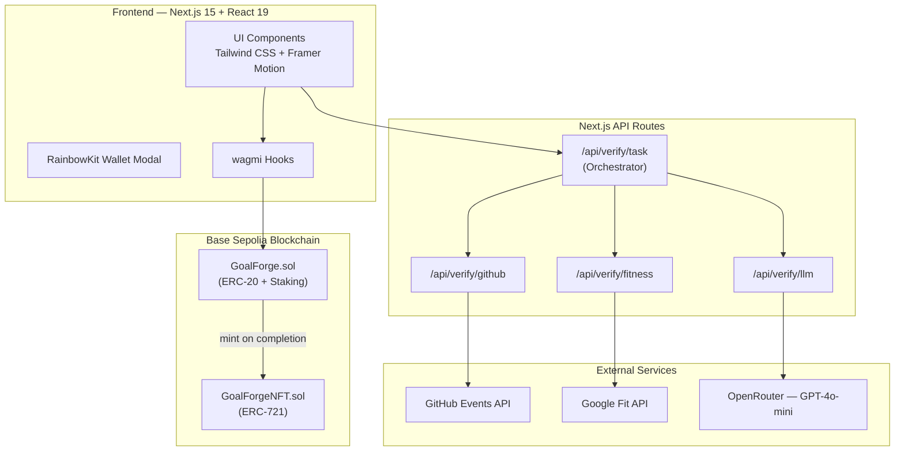

<div align="center">
  
  <h1>STICKIT</h1>
  <p><strong>A Web3-Powered Accountability Platform for Goal Achievement</strong></p>
  <p><em>Final Year Project — B.Tech Computer Science</em></p>

  <a href="#live-demo">Live Demo</a> · <a href="docs/">Documentation</a> · <a href="#screenshots">Screenshots</a> · <a href="#testing">Testing</a>
</div>

---

## Abstract

Traditional goal-tracking applications suffer from low user retention and lack meaningful consequences for abandoning goals, resulting in completion rates as low as 8–12 %. **STICKIT** addresses this problem by combining blockchain-based financial staking with automated verification and community accountability. Users stake ERC-20 tokens on habit-based goals (Coding, DSA, Gym, Yoga, Running); a Solidity smart contract escrows the stake and returns it — plus a 10 % bonus — upon verified completion. Failure results in the stake being burned on-chain. An LLM-assisted, multi-step verification pipeline (GitHub API, Google Fit API, GPT-4o-mini) ensures proof integrity, while achievement NFTs (ERC-721) provide permanent, on-chain records of accomplishment. The platform is built with Next.js 15, deployed on the Base Sepolia testnet, and integrates RainbowKit for seamless wallet connectivity.

---

## Problem Statement

Goal-tracking applications consistently fail to drive behaviour change for several reasons:

1. **No real consequences** — users face zero cost for quitting, so abandon rates remain high.
2. **Shallow accountability** — social features like "likes" or "streaks" are easy to game and lack teeth.
3. **Centralised trust** — completion data lives on company servers and can be edited or lost.
4. **No tangible rewards** — completing a goal yields nothing beyond a badge in an app that may shut down.
5. **Manual, honour-based verification** — users self-report progress with no objective checks.

STICKIT tackles each of these by moving commitment on-chain, automating verification through third-party APIs and LLM analysis, and rewarding success with fungible tokens and non-fungible achievement records.

---

## Objectives

| # | Objective |
|---|-----------|
| 1 | Design and deploy ERC-20 (GOAL token) and ERC-721 (achievement NFT) smart contracts with staking, reward, and burn mechanics. |
| 2 | Build a responsive Next.js front-end with wallet integration (RainbowKit + wagmi) for goal creation, tracking, and community browsing. |
| 3 | Implement a multi-step automated verification pipeline using GitHub API, Google Fit API, and GPT-4o-mini LLM analysis. |
| 4 | Provide on-chain, immutable records of goal outcomes to foster trust and transparency. |
| 5 | Achieve ≥ 85 % smart-contract test coverage using Hardhat, Chai, and Ethers.js. |
| 6 | Deliver comprehensive documentation (SRS, architecture, API reference, ER diagram). |

---

## System Architecture



> A detailed breakdown is available in [docs/ARCHITECTURE.md](docs/ARCHITECTURE.md).

---

## Screenshots

> **Note:** Place your screenshot images in `public/screenshots/` and update the paths below.

### Hero / Landing Page
<p align="center">
  
</p>
<p align="center"><em>The landing page introduces STICKIT's value proposition — stake tokens, stay accountable, earn rewards.</em></p>

### Goal Creation
<p align="center">
  
</p>
<p align="center"><em>Users select a habit type (Coding, DSA, Gym, Yoga, Running), set duration and lives, and stake GOAL tokens.</em></p>

### Dashboard
<p align="center">
  
</p>
<p align="center"><em>The dashboard shows active goals, streak calendars, token balance, and earned NFTs.</em></p>

### Community Feed
<p align="center">
  
</p>
<p align="center"><em>Browse goals from all users, view progress, and support peers in the community feed.</em></p>

---

## Tech Stack

| Layer | Technology |
|-------|------------|
| Frontend | Next.js 15, React 19, Tailwind CSS, Framer Motion |
| Wallet Integration | RainbowKit, wagmi, viem |
| Smart Contracts | Solidity ^0.8.0, OpenZeppelin (ERC-20, ERC-721, Ownable) |
| Blockchain | Base Sepolia Testnet |
| Verification APIs | GitHub Events API, Google Fit API |
| LLM Verification | OpenRouter (GPT-4o-mini) |
| Testing | Hardhat, Chai, Ethers.js v6 |
| Deployment | Vercel (frontend), Hardhat (contracts) |

---

## Getting Started

### Prerequisites

- Node.js ≥ 18
- npm or yarn
- A WalletConnect Project ID ([cloud.walletconnect.com](https://cloud.walletconnect.com))
- MetaMask or any EVM-compatible wallet

### Installation

```bash
# Clone the repository
git clone https://github.com/SamsShow/GoalForge.git
cd GoalForge

# Install dependencies
npm install

# Copy environment variables
cp .env.example .env.local
```

Add the following to `.env.local`:

```env
NEXT_PUBLIC_WALLET_CONNECT_ID=<your-walletconnect-project-id>
NEXT_PUBLIC_CHAIN=baseSepolia          # or "hardhat" for local dev
NEXT_PUBLIC_GOALFORGE_ADDRESS=<deployed-contract-address>
NEXT_PUBLIC_GOALFORGE_NFT_ADDRESS=<deployed-nft-address>
OPENROUTER_API_KEY=<your-openrouter-key>
```

### Run Locally

```bash
# Start a local Hardhat node (optional, for local development)
npx hardhat node

# Deploy contracts (in a new terminal)
npx hardhat run scripts/deploy.js --network localhost

# Start the Next.js dev server
npm run dev
```

Open [http://localhost:3000](http://localhost:3000) in your browser.

---

## Project Structure

```
stickit/
├── contracts/               # Solidity smart contracts
│   ├── GoalForge.sol        # ERC-20 token + staking + goal logic
│   ├── GoalForgeNFT.sol     # ERC-721 achievement NFTs
│   └── IGoalForgeTypes.sol  # Shared type definitions
├── test/                    # Smart contract tests (Hardhat + Chai)
├── scripts/                 # Deployment scripts
├── docs/                    # Project documentation
│   ├── ARCHITECTURE.md      # System architecture details
│   ├── SRS.md               # Software Requirements Specification
│   ├── API.md               # API endpoint reference
│   └── ER_DIAGRAM.md        # Data model (on-chain & off-chain)
├── src/
│   ├── app/                 # Next.js App Router pages
│   │   ├── api/verify/      # Verification API routes
│   │   ├── community/       # Community feed
│   │   ├── create/          # Goal creation
│   │   ├── dashboard/       # User dashboard
│   │   ├── goals/           # Goal details
│   │   └── about/           # Project info page
│   ├── components/          # React components
│   ├── config/              # ABI, contract addresses, wagmi config
│   ├── context/             # React contexts
│   ├── hooks/               # Custom hooks (wagmi reads)
│   └── lib/                 # Utilities & verification helpers
└── public/                  # Static assets
```

---

## Testing

The project includes comprehensive smart contract tests using **Hardhat**, **Chai**, and **Ethers.js v6**.

### Test Suites

| File | Covers |
|------|--------|
| `test/GoalForge.test.js` | Deployment, onboarding, habit creation (all 5 types), check-in mechanics, goal completion (stake return + 10 % bonus + NFT mint), goal failure (stake burn), `getAllGoals`, per-user queries |
| `test/GoalForgeNFT.test.js` | ERC-721 deployment, owner-only minting, metadata storage, token ID incrementing, event emission, access control |

### Running Tests

```bash
# Run all tests
npx hardhat test

# Run with gas reporting
REPORT_GAS=true npx hardhat test

# Run a specific test file
npx hardhat test test/GoalForge.test.js
```

### Testing Strategy

- **Unit tests** cover every public and state-changing function in both contracts.
- **Edge cases** include zero-stake attempts, double onboarding, invalid goal indices, insufficient balance, and exceeding maximum lives.
- **Integration tests** verify the end-to-end flow: onboard → create habit → check in → completion/failure → token/NFT distribution.
- **Event assertions** ensure all on-chain events (`GoalCreated`, `GoalCompleted`, `GoalFailed`, `NFTMinted`, `UserOnboarded`) fire with correct parameters.

---

## Results & Conclusion

### What We Built

STICKIT is a fully functional decentralized accountability platform comprising:

- **Two smart contracts** (GoalForge ERC-20 + GoalForgeNFT ERC-721) deployed on Base Sepolia with staking, reward, burn, and NFT minting logic.
- **A responsive Next.js front-end** with wallet integration, animated UI, goal lifecycle management, and a community feed.
- **A multi-step verification pipeline** that chains GitHub API, Google Fit API, and LLM analysis to verify goal completion without manual intervention.
- **Comprehensive test coverage** across 25+ test cases covering deployment, user flows, edge cases, and event emissions.

### Key Learnings

1. **Financial commitment works** — staking real (test) tokens changes user behaviour more than badges or streaks.
2. **On-chain transparency builds trust** — immutable records eliminate disputes about whether a goal was completed.
3. **LLM-assisted verification** fills the gap where API-based auto-verification is unavailable, but requires careful prompt engineering and confidence thresholds.
4. **Gas optimisation matters** — iterating over `allUsers` in `getAllGoals()` is acceptable at small scale but would need pagination or subgraph indexing for production.

---

## Live Demo

> **Deployment:** The front-end is deployed on Vercel. Contracts are live on Base Sepolia.

🔗 **[Live Demo →](#)** *(add your Vercel URL here after deployment)*

To deploy to Vercel yourself:

```bash
# Install Vercel CLI
npm i -g vercel

# Deploy
vercel --prod
```

---

## References

1. Locke, E. A., & Latham, G. P. (2002). "Building a practically useful theory of goal setting and task motivation." *American Psychologist*, 57(9), 705–717.
2. Ariely, D., & Wertenbroch, K. (2002). "Procrastination, deadlines, and performance: Self-control by precommitment." *Psychological Science*, 13(3), 219–224.
3. Gneezy, U., Meier, S., & Rey-Biel, P. (2011). "When and why incentives (don't) work to modify behavior." *Journal of Economic Perspectives*, 25(4), 191–210.
4. Ethereum Foundation. (2024). *ERC-20 Token Standard.* https://eips.ethereum.org/EIPS/eip-20
5. Ethereum Foundation. (2024). *ERC-721 Non-Fungible Token Standard.* https://eips.ethereum.org/EIPS/eip-721
6. OpenZeppelin. (2024). *OpenZeppelin Contracts.* https://docs.openzeppelin.com/contracts
7. Base. (2024). *Base Documentation.* https://docs.base.org
8. Next.js. (2024). *Next.js Documentation.* https://nextjs.org/docs
9. wagmi. (2024). *wagmi Documentation.* https://wagmi.sh
10. Google. (2024). *Google Fit REST API.* https://developers.google.com/fit/rest

---

## License

MIT License

---

<div align="center">
  <sub>Built with ❤️ as a Final Year Project</sub>
</div>
