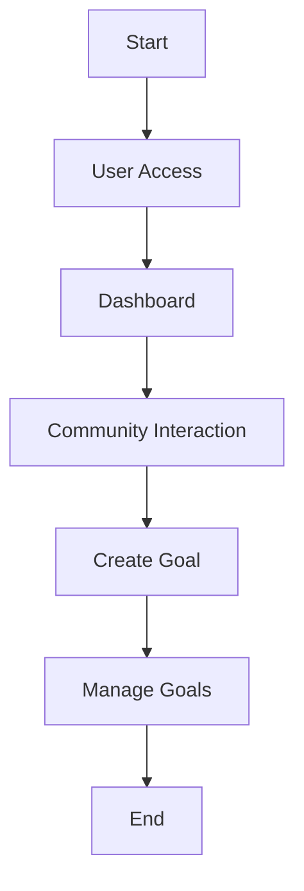

This is a [Next.js](https://nextjs.org) project bootstrapped with [`create-next-app`](https://github.com/vercel/next.js/tree/canary/packages/create-next-app).

## Project Overview
GoalForge is a blockchain-based platform that simplifies access to blockchain technology and reduces transaction costs through the Avalanche network. It empowers users to manage and achieve their goals in a decentralized, community-driven environment.

## Vision Statement
GoalForge aims to provide user-friendly blockchain access, enabling cost-effective transactions and fostering a community-driven approach to goal management.

## Features
- User-friendly interface for managing goals
- Cost-effective transactions via Avalanche
- Community-driven goal management
- Real-time updates and notifications

## Installation
To set up the project locally, follow these steps:

1. Clone the repository:
   ```bash
   git clone <repository-url>
   ```
2. Navigate to the project directory:
   ```bash
   cd goalforge
   ```
3. Install dependencies:
   ```bash
   npm install
   ```
4. Run the development server:
   ```bash
   npm run dev
   ```

## Usage
Open [http://localhost:3000](http://localhost:3000) in your browser to access the application. You can start managing your goals and interacting with the community.

## Workflow
The application is structured into several components:
- **Dashboard**: Displays an overview of goals and recent transactions.
- **Community**: Allows users to interact and collaborate on goals.
- **Create**: Enables users to create new goals.
- **Goals**: Manages individual goals and tracks progress.

## Workflow Diagram



## License
This project is licensed under the MIT License.

## Learn More

To learn more about Next.js, take a look at the following resources:

- [Next.js Documentation](https://nextjs.org/docs) - learn about Next.js features and API.
- [Learn Next.js](https://nextjs.org/learn) - an interactive Next.js tutorial.

You can check out [the Next.js GitHub repository](https://github.com/vercel/next.js) - your feedback and contributions are welcome!

## Deploy on Vercel

The easiest way to deploy your Next.js app is to use the [Vercel Platform](https://vercel.com/new?utm_medium=default-template&filter=next.js&utm_source=create-next-app&utm_campaign=create-next-app-readme) from the creators of Next.js.

Check out our [Next.js deployment documentation](https://nextjs.org/docs/app/building-your-application/deploying) for more details.
