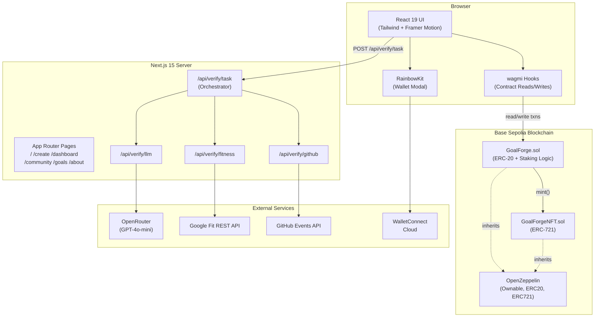
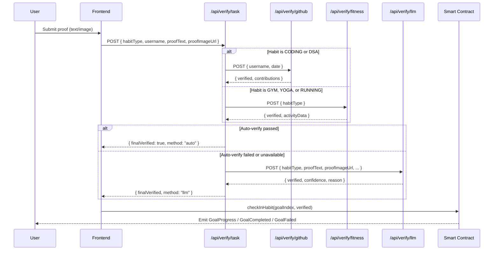
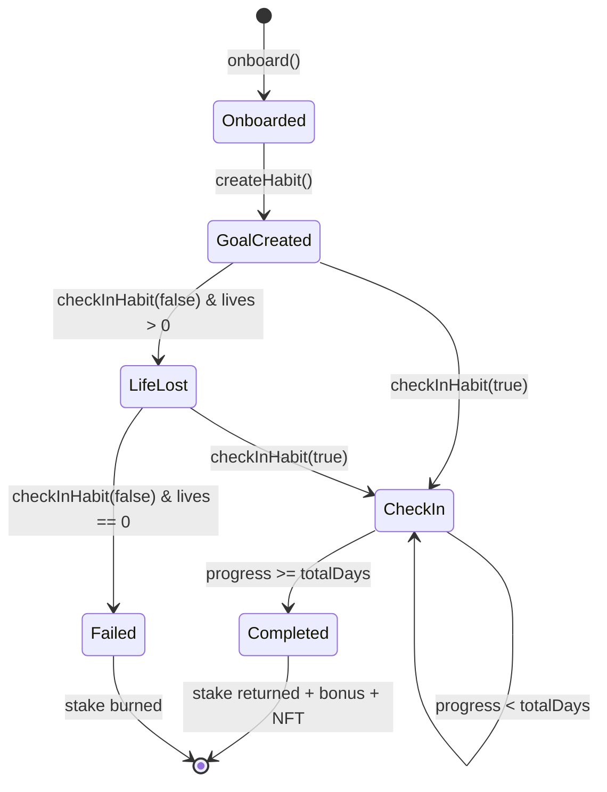

# STICKIT — System Architecture

## Overview

STICKIT follows a decentralised application (dApp) architecture with three primary layers: a Next.js front-end, a Next.js API layer for off-chain verification, and on-chain Solidity smart contracts deployed on the Base Sepolia testnet.

---

## High-Level Architecture Diagram

---

## 1. Frontend Layer

### Technology
- **Next.js 15** with the App Router for file-system-based routing
- **React 19** for component rendering
- **Tailwind CSS** for utility-first styling
- **Framer Motion** for page and element animations

### Key Pages

| Route | Purpose |
|-------|---------|
| `/` | Landing page with hero, features, testimonials, CTA |
| `/create` | Goal creation form (habit type, duration, lives, stake amount) |
| `/dashboard` | Active goals, streak calendar, token balance, NFTs |
| `/community` | Browse all users' goals and progress |
| `/goals` | Individual goal detail and check-in |
| `/about` | Project information, team, technologies |

### Wallet Integration
- **RainbowKit** provides a pre-built connect modal supporting MetaMask, WalletConnect, Coinbase Wallet, and injected providers.
- **wagmi** hooks (`useContractRead`, `useContractWrite`, `useAccount`) handle all blockchain interactions.
- **viem** serves as the low-level Ethereum client under wagmi.

### Custom Hooks (`src/hooks/useContract.js`)
- `useUserGoals(address)` — fetch all goals for a user
- `useGetAllGoals()` — fetch community-wide goals
- `useUserNFTs(address)` — fetch earned NFTs
- `useHasOnboarded(address)` — check onboarding status
- `useUserBalance(address)` — fetch GOAL token balance
- `useUserStakes(address)` — fetch staked amount

---

## 2. API / Verification Layer

All verification routes live under `src/app/api/verify/` and follow the Next.js Route Handler pattern.

### Verification Flow

### `/api/verify/task` — Orchestrator
1. Receives proof submission from the client.
2. **Step 1 (Auto-verify):** Calls GitHub API (for CODING/DSA) or Google Fit API (for GYM/YOGA/RUNNING).
3. **Step 2 (LLM Fallback):** If auto-verify doesn't pass, forwards all data to GPT-4o-mini via OpenRouter. Passes if confidence ≥ 60 %.
4. Returns a structured response with verification steps, final result, and method used.

### `/api/verify/github`
- Fetches `GET /users/{username}/events` from the GitHub API.
- Filters events by target date.
- Categorises into pushes, PRs, issues, creates, and reviews.
- Cross-references with a contribution graph API for additional validation.

### `/api/verify/fitness`
- Uses Google Fit REST API with OAuth2.
- Supports GYM (≥ 20 min), YOGA (≥ 15 min), RUNNING (≥ 10 min or ≥ 3,000 steps).
- OAuth callback stores tokens in httpOnly cookies.

### `/api/verify/llm`
- Sends habit-specific system prompts and user proof to OpenRouter's `openai/gpt-4o-mini`.
- Returns verification verdict, confidence score, and reasoning.

---

## 3. Smart Contract Layer

### GoalForge.sol (ERC-20 + Staking)

| Function | Visibility | Description |
|----------|-----------|-------------|
| `constructor(address _nftContract)` | public | Deploys token (name: "GoalForge", symbol: "GOAL"), mints 1M tokens to owner |
| `onboard()` | external | Mints 100 GOAL tokens to first-time users |
| `createHabit(...)` | external | Creates a goal, transfers stake to contract |
| `checkInHabit(goalIndex, completed)` | external | Processes daily check-in; triggers completion or failure |
| `completeGoal(user, goalIndex)` | internal | Returns stake + 10 % bonus, mints NFT |
| `failGoal(user, goalIndex)` | internal | Burns staked tokens |
| `getAllGoals()` | external view | Returns all goals across all users |
| `getUserGoals(address)` | external view | Returns goals for a specific user |
| `getUserNFTs(address)` | external view | Returns NFT token IDs for a user |

### GoalForgeNFT.sol (ERC-721)

| Function | Visibility | Description |
|----------|-----------|-------------|
| `constructor()` | public | Deploys NFT (name: "GoalForge NFT", symbol: "GNFT") |
| `mint(to, habitType, daysCompleted)` | external onlyOwner | Mints achievement NFT with metadata |
| `getTokenMetadata(tokenId)` | external view | Returns habit type, mint timestamp, days completed |

### Contract Interaction Flow

---

## 4. Data Flow Summary

1. **User connects wallet** → RainbowKit → wagmi provider established.
2. **User onboards** → `onboard()` tx → 100 GOAL tokens minted.
3. **User creates goal** → `createHabit()` tx → tokens transferred to contract.
4. **Daily check-in** → user submits proof → API verifies → `checkInHabit()` tx.
5. **Goal completed** → stake returned + 10 % bonus minted + NFT minted.
6. **Goal failed** → stake burned on-chain.

---

## 5. Deployment Architecture

| Component | Platform | Notes |
|-----------|----------|-------|
| Frontend | Vercel | Auto-deploys from main branch |
| Smart Contracts | Base Sepolia | Deployed via Hardhat `scripts/deploy.js` |
| API Routes | Vercel Serverless | Co-deployed with frontend |
| External APIs | GitHub, Google, OpenRouter | Accessed server-side only |
