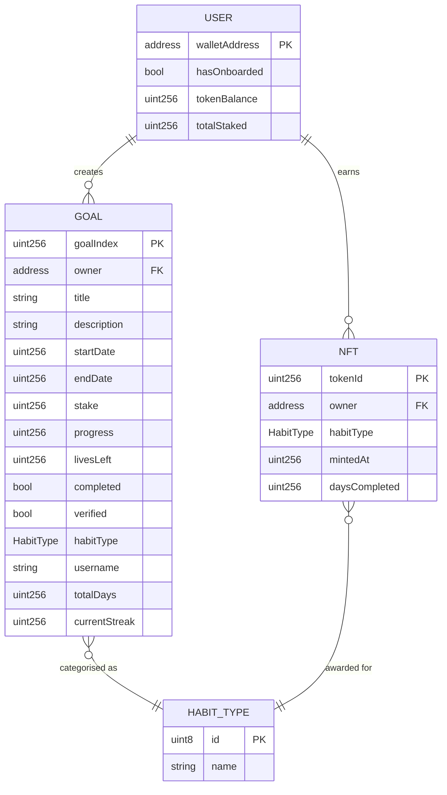
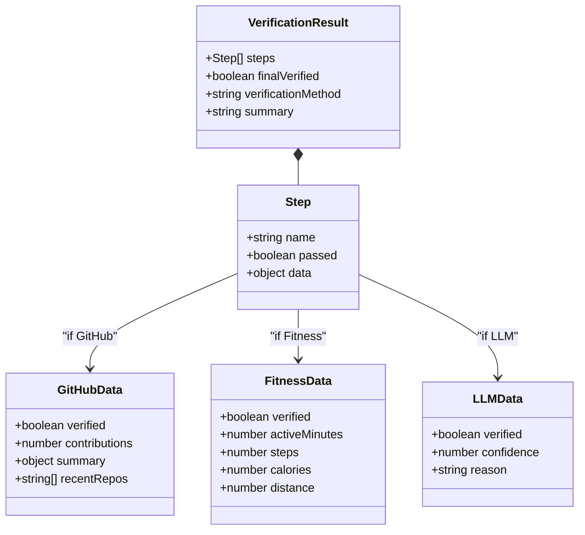
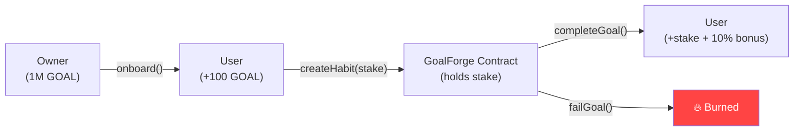

# STICKIT — Data Model & ER Diagram

## Overview

STICKIT's data model is primarily **on-chain** — all goal, token, and NFT data lives in Solidity smart contract storage on the Base Sepolia blockchain. Off-chain data is limited to transient API verification results and Google Fit OAuth tokens stored in browser cookies.

---

## On-Chain Data Model

### Entity Relationship Diagram



---

## Contract Storage Layout

### GoalForge.sol (ERC-20)

| Storage Variable | Type | Description |
|-----------------|------|-------------|
| `nftContract` | `IGoalForgeNFT` | Reference to the NFT contract |
| `userGoals` | `mapping(address => Goal[])` | All goals per user address |
| `userStakes` | `mapping(address => uint256)` | Total staked tokens per user |
| `userNFTs` | `mapping(address => uint256[])` | NFT token IDs earned per user |
| `hasOnboarded` | `mapping(address => bool)` | Onboarding status per user |
| `allUsers` | `address[]` | List of all users who created goals |

#### Goal Struct

```solidity
struct Goal {
    string title;
    string description;
    uint256 startDate;
    uint256 endDate;
    uint256 stake;
    uint256 progress;
    uint256 livesLeft;
    bool completed;
    bool verified;
    HabitType habitType;
    string username;
    uint256 totalDays;
    uint256 currentStreak;
}
```

#### GoalWithUser Struct (View)

```solidity
struct GoalWithUser {
    address user;          // Added for getAllGoals() return
    string title;
    string description;
    uint256 startDate;
    uint256 endDate;
    uint256 stake;
    uint256 progress;
    uint256 livesLeft;
    bool completed;
    bool verified;
    HabitType habitType;
    string username;
    uint256 totalDays;
    uint256 currentStreak;
}
```

### GoalForgeNFT.sol (ERC-721)

| Storage Variable | Type | Description |
|-----------------|------|-------------|
| `tokenMetadata` | `mapping(uint256 => NFTMetadata)` | Metadata per token ID |
| `_nextTokenId` | `uint256` | Auto-incrementing token counter |

#### NFTMetadata Struct

```solidity
struct NFTMetadata {
    IGoalForgeTypes.HabitType habitType;
    uint256 mintedAt;
    uint256 daysCompleted;
}
```

---

## HabitType Enum

Shared across contracts via `IGoalForgeTypes.sol`:

| Value | Name | Verification Method |
|-------|------|-------------------|
| 0 | CODING | GitHub Events API |
| 1 | DSA | GitHub Events API |
| 2 | GYM | Google Fit API (≥ 20 min) |
| 3 | YOGA | Google Fit API (≥ 15 min) |
| 4 | RUNNING | Google Fit API (≥ 10 min / ≥ 3K steps) |

---

## Off-Chain Data

STICKIT does **not** use a traditional database. All persistent state lives on-chain. The following transient data exists off-chain:

### Browser Cookies

| Cookie | Type | Purpose | Lifetime |
|--------|------|---------|----------|
| `google_fit_access_token` | httpOnly | Google Fit API access | Session |
| `google_fit_refresh_token` | httpOnly | Google Fit token refresh | Long-lived |

### API Verification Response (Transient)

The verification pipeline returns a response object that is consumed by the frontend but not persisted:



---

## Token Economics

| Parameter | Value |
|-----------|-------|
| Token Name | GoalForge |
| Symbol | GOAL |
| Decimals | 18 |
| Initial Supply | 1,000,000 GOAL (to owner) |
| Onboarding Reward | 100 GOAL |
| Completion Bonus | 10 % of staked amount (minted) |
| Failure Penalty | 100 % of stake (burned) |

### Token Flow Diagram



---

## NFT Relationship

Each completed goal produces exactly one NFT:

```
1 Goal Completed → 1 NFT Minted → Stored in userNFTs[address]
```

The NFT records:
- **Which habit** was completed (HabitType)
- **When** it was completed (mintedAt timestamp)
- **Duration** of the commitment (daysCompleted)

This creates a permanent, transferable, on-chain achievement record.
