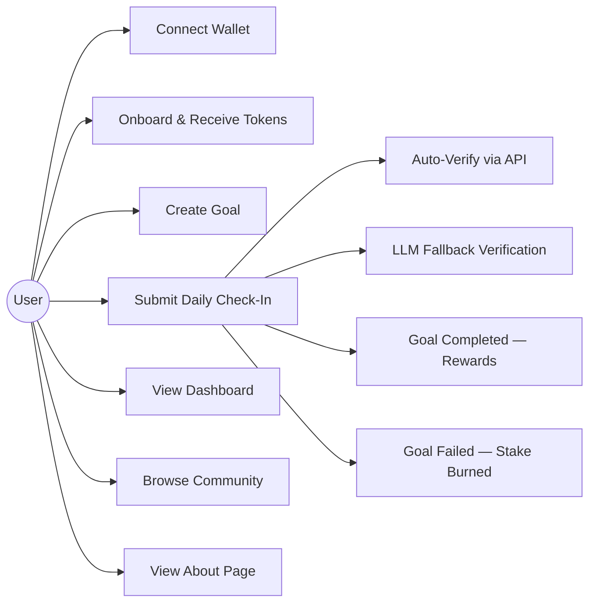

# Software Requirements Specification (SRS)

## STICKIT — Web3-Powered Goal Achievement Platform

**Version:** 1.0  
**Date:** February 2026  
**Project Type:** Final Year Project — B.Tech Computer Science

---

## 1. Introduction

### 1.1 Purpose
This document specifies the software requirements for STICKIT, a decentralised application (dApp) that enables users to stake cryptocurrency tokens on personal goals. The system uses blockchain smart contracts for transparent staking and reward distribution, and third-party APIs combined with LLM analysis for automated goal verification.

### 1.2 Scope
STICKIT covers:
- User onboarding and wallet connection
- Goal creation with customisable parameters (habit type, duration, lives, stake)
- Daily check-in and proof submission
- Multi-step automated verification (GitHub, Google Fit, LLM)
- Token staking, reward distribution, and stake burning
- Achievement NFT minting
- Community goal browsing

### 1.3 Definitions & Acronyms

| Term | Definition |
|------|-----------|
| dApp | Decentralised Application |
| ERC-20 | Ethereum token standard for fungible tokens |
| ERC-721 | Ethereum token standard for non-fungible tokens (NFTs) |
| GOAL | The in-app ERC-20 token used for staking |
| Stake | Tokens locked in a smart contract as commitment |
| Lives | Allowed missed check-ins before a goal fails |
| LLM | Large Language Model |
| wagmi | React hooks library for Ethereum |

---

## 2. Overall Description

### 2.1 Product Perspective
STICKIT is a standalone web application that interacts with the Base Sepolia blockchain. It is not a component of a larger system but integrates with external services (GitHub, Google Fit, OpenRouter) for verification.

### 2.2 User Classes

| User Class | Description |
|-----------|-------------|
| New User | Has not connected a wallet or onboarded |
| Onboarded User | Has connected a wallet and received initial GOAL tokens |
| Active User | Has one or more active goals with staked tokens |
| Community Member | Browses other users' goals on the community feed |

### 2.3 Operating Environment
- **Browser:** Modern browsers (Chrome, Firefox, Edge, Safari) with Web3 wallet extension (e.g., MetaMask)
- **Network:** Base Sepolia Testnet (Chain ID: 84532)
- **Server:** Vercel serverless functions (Node.js 18+)

### 2.4 Constraints
- Requires an Ethereum-compatible wallet
- Limited to five habit types: Coding, DSA, Gym, Yoga, Running
- Verification accuracy depends on third-party API availability
- Testnet tokens have no real monetary value

---

## 3. Functional Requirements

### FR-01: Wallet Connection
- The system SHALL allow users to connect an Ethereum wallet via RainbowKit.
- The system SHALL support MetaMask, WalletConnect, Coinbase Wallet, and injected providers.
- The system SHALL display the connected address in the navigation bar.

### FR-02: User Onboarding
- The system SHALL detect whether a connected user has onboarded via `hasUserOnboarded(address)`.
- The system SHALL present an onboarding modal to new users.
- The system SHALL mint 100 GOAL tokens to the user upon onboarding.
- The system SHALL prevent double onboarding.

### FR-03: Goal Creation
- The system SHALL allow users to select a habit type from: CODING (0), DSA (1), GYM (2), YOGA (3), RUNNING (4).
- The system SHALL accept duration (in days, > 0), lives (0–5), and stake amount (> 0, ≤ balance).
- The system SHALL transfer the staked tokens from the user to the contract.
- The system SHALL emit a `GoalCreated` event on-chain.

### FR-04: Daily Check-In
- The system SHALL allow users to submit proof for a daily check-in.
- The system SHALL accept text descriptions and optional image URLs as proof.
- The system SHALL call the verification pipeline before recording the check-in on-chain.

### FR-05: Automated Verification
- **CODING/DSA:** The system SHALL query the GitHub Events API for the user's contributions on the target date.
- **GYM/YOGA/RUNNING:** The system SHALL query the Google Fit API for activity data, applying minimum thresholds (GYM ≥ 20 min, YOGA ≥ 15 min, RUNNING ≥ 10 min or ≥ 3,000 steps).
- **LLM Fallback:** If auto-verification is unavailable or fails, the system SHALL forward proof data to GPT-4o-mini and require ≥ 60 % confidence to pass.

### FR-06: Goal Completion
- When `progress >= totalDays`, the system SHALL mark the goal as completed and verified.
- The system SHALL return the staked tokens to the user.
- The system SHALL mint a 10 % bonus in GOAL tokens.
- The system SHALL mint an achievement NFT via `GoalForgeNFT.mint()`.
- The system SHALL emit `GoalCompleted` and `NFTMinted` events.

### FR-07: Goal Failure
- When a user misses a check-in and has 0 lives remaining, the system SHALL mark the goal as failed.
- The system SHALL burn the staked tokens.
- The system SHALL emit a `GoalFailed` event.

### FR-08: Dashboard
- The system SHALL display active goals with progress bars, streaks, and remaining lives.
- The system SHALL display the user's GOAL token balance and total staked amount.
- The system SHALL display earned NFTs.
- The system SHALL provide a calendar view of check-in history.

### FR-09: Community Feed
- The system SHALL display all goals from all users via `getAllGoals()`.
- The system SHALL show goal title, username, progress, habit type, and stake amount.

### FR-10: About Page
- The system SHALL provide an about page with project details, team information, technologies used, and institution.

---

## 4. Non-Functional Requirements

### NFR-01: Performance
- Pages SHALL load within 3 seconds on a broadband connection.
- Smart contract interactions SHALL complete within 1 block confirmation.

### NFR-02: Security
- API keys (OpenRouter, Google Fit) SHALL be stored server-side only.
- Google Fit tokens SHALL be stored in httpOnly cookies.
- Smart contracts SHALL use OpenZeppelin's audited implementations.
- Only the GoalForge contract (as NFT owner) SHALL be able to mint NFTs.

### NFR-03: Usability
- The UI SHALL be responsive across desktop, tablet, and mobile viewports.
- Wallet connection SHALL guide users with clear prompts and error messages.
- Goal creation SHALL validate inputs client-side before submitting transactions.

### NFR-04: Reliability
- Smart contract state SHALL be immutable once written to the blockchain.
- The frontend SHALL gracefully handle RPC failures and display user-friendly error messages.

### NFR-05: Maintainability
- Code SHALL follow a modular structure with separated concerns (components, hooks, config, lib).
- Smart contracts SHALL be tested with ≥ 85 % function coverage.

---

## 5. System Interfaces

### 5.1 External APIs

| API | Purpose | Auth Method |
|-----|---------|-------------|
| GitHub Events API | Verify coding/DSA contributions | Public (rate-limited) |
| GitHub Contribution Graph API | Cross-reference contribution counts | Public |
| Google Fit REST API | Verify fitness activities | OAuth 2.0 |
| OpenRouter API | LLM-based proof verification | API Key |

### 5.2 Smart Contract Interfaces

| Contract | Standard | Deployed On |
|----------|----------|-------------|
| GoalForge | ERC-20 | Base Sepolia |
| GoalForgeNFT | ERC-721 | Base Sepolia |

---

## 6. Use Case Diagram

---

## 7. Approval

| Role | Name | Date |
|------|------|------|
| Developer | *(your name)* | February 2026 |
| Supervisor | *(supervisor name)* | |
